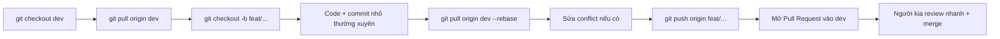

# RULEBASE — Quy tắc làm việc & Chống Conflict

> Đọc file này TRƯỚC KHI code. Mọi thành viên tuân thủ để tránh xung đột Git và lệch nhau.

---

## 0. KIẾN TRÚC SẢN PHẨM (đã chốt)

**Chỉ MỘT app điện thoại — không có web.** App có 2 chế độ chuyển bằng một nút:
- Chế độ **Bán hàng** (mặc định): lưới món, chạm để bán, hoạt động offline.
- Chế độ **Quản lý**: doanh thu, biểu đồ, thuế ước tính, nhắc hạn, lịch sử hóa đơn, xuất file.

→ Phục vụ hộ một mình (vừa chủ vừa bán) chỉ cần 1 điện thoại. Mọi việc gói gọn trong app.

> **Lưu ý thuyết trình:** Cuộc thi khuyến khích "web/app". Khi chỉ có app, phải giải trình rõ: "khách hàng cốt lõi là hộ một mình dùng điện thoại, nên một app là thiết kế đúng — gộp web vào sẽ phản tác dụng." Biến việc thiếu web thành lựa chọn có chủ đích.

---

## 1. CẤU TRÚC REPO

Dùng **1 repo duy nhất**:

```
taxeasy/
├── app/          # Flutter — SẢN PHẨM CHÍNH (Thành viên A chủ đạo)
├── server/       # NestJS — Backend (Thành viên B sở hữu)
├── shared/       # API contract dùng chung — SỬA CÓ THỎA THUẬN
├── docs/         # Báo cáo, sơ đồ, ghi chú
└── task-plan/    # Bộ task này (TASK/DONE/BUGS)
```

**Nguyên tắc sở hữu (code ownership):**
- Thành viên A: chủ đạo trong `app/`.
- Thành viên B: toàn quyền trong `server/`.
- `shared/`: **vùng nhạy cảm** — chỉ sửa khi cả hai đồng ý (xem mục 4).

> Vì chỉ còn app + server, hai người ít đụng file nhau hơn. Điểm đụng duy nhất là `shared/`.

---

## 2. QUY TẮC NHÁNH (Git Branching)

- Nhánh chính: `main` — **luôn ở trạng thái chạy được**, không commit thẳng.
- Nhánh tích hợp: `dev` — gộp công việc hằng ngày.
- Nhánh tính năng: `feat/<scope>-<mô-tả>`.

| Loại | Mẫu | Ví dụ |
|---|---|---|
| Tính năng app | `feat/app-<...>` | `feat/app-grid-menu` |
| Tính năng server | `feat/api-<...>` | `feat/api-sync` |
| Sửa lỗi | `fix/<scope>-<...>` | `fix/api-invoice-number` |
| Tài liệu | `docs/<...>` | `docs/report-outline` |

→ Mỗi task đã ghi sẵn tên nhánh cần dùng.

---

## 3. LUỒNG LÀM VIỆC HẰNG NGÀY (chống conflict)



**Bắt buộc:**
1. **Đầu ngày:** `git checkout dev && git pull origin dev` trước khi tạo nhánh mới.
2. **Trước khi push:** `git pull origin dev --rebase` để cập nhật & xử lý conflict cục bộ.
3. **Commit nhỏ, thường xuyên** (mỗi mục DONE ~1 commit).
4. **Không bao giờ** `git push --force` lên `dev` hoặc `main`.
5. Merge vào `dev` qua **Pull Request**, người kia liếc qua rồi approve.

---

## 4. QUY TẮC VÙNG `shared/` (nguồn conflict lớn nhất)

`shared/` chứa **API contract** (định nghĩa endpoint, kiểu dữ liệu request/response). App (A) và server (B) đều phụ thuộc vào đây → đây là điểm dễ lệch nhất giữa hai người.

- **Chốt API contract ở Ngày 2**, ghi vào `shared/api-contract.md`. Sau đó hạn chế sửa.
- Cần đổi contract → **nhắn người kia TRƯỚC khi sửa**, sửa xong push ngay, báo "đã đổi contract X".
- App dùng **mock data** khớp contract để chạy độc lập, không phải chờ backend.
- Không tự ý đổi tên trường/endpoint mà không báo.

---

## 5. QUY ƯỚC COMMIT MESSAGE

Mẫu: `<type>(<scope>): <mô tả ngắn>`

| type | Dùng khi |
|---|---|
| `feat` | Thêm tính năng |
| `fix` | Sửa lỗi |
| `refactor` | Sửa cấu trúc, không đổi hành vi |
| `docs` | Tài liệu |
| `chore` | Cấu hình, dọn dẹp |

Ví dụ: `feat(app): them luoi mon mot cham`, `fix(api): sua sinh so hoa don bi trung`

---

## 6. XỬ LÝ CONFLICT KHI XẢY RA

1. **Bình tĩnh, không xóa code người khác.** Đọc cả hai phía.
2. Không chắc → **nhắn người kia** trước khi quyết.
3. Conflict ở `shared/` → **luôn hỏi nhau**.
4. Sau khi resolve: chạy lại test/build trước khi push.
5. Ghi vào file BUGS của task nếu conflict gây lỗi.

---

## 7. FILE MÔI TRƯỜNG & BÍ MẬT

- **Không commit** `.env`, khóa, token, file build (`build/`, `node_modules/`, `*.apk`).
- Mỗi thư mục có `.gitignore` phù hợp + file `.env.example`.
- Chia sẻ biến môi trường qua kênh riêng (không đẩy lên repo).

---

## 8. CÁCH DÙNG FILE TASK / DONE / BUGS

- **TASK_*.md:** danh sách việc — đọc đầu task, làm theo thứ tự.
- **DONE_*.md:** tick `[x]` mỗi khi xong 1 mục. Thước đo tiến độ.
- **BUGS_*.md:** ghi NGAY khi gặp bug (mô tả, tái hiện, trạng thái).
- Cập nhật 3 file này cũng commit như code (`docs(task): cap nhat tien do task X`).

---

## 9. ĐỒNG BỘ HẰNG NGÀY (15 phút)

- **Đầu ngày:** mỗi người nói nhanh "hôm nay làm task gì, có chặn gì không".
- **Cuối ngày:** push hết code, cập nhật DONE/BUGS, đảm bảo `dev` vẫn chạy.

---

## 10. NGUYÊN TẮC VÀNG

> **`main` và `dev` luôn build/chạy được. Commit nhỏ. Pull trước khi push. `shared/` phải hỏi nhau. Ghi bug ngay khi gặp.**

---

## 11. PHÂN VAI TỔNG QUÁT

- **Thành viên A** — App Flutter (sản phẩm chính): cả chế độ Bán hàng lẫn Quản lý, offline, QR, biểu đồ, xuất file. Đây là phần nặng nhất.
- **Thành viên B** — Backend NestJS + Data: API, sinh hóa đơn/XML, tính thuế, đồng bộ, idempotency.

> Vì không còn web, B có thêm thời gian: hỗ trợ A test app, lo phần XML/thuế kỹ hơn, và chuẩn bị báo cáo sớm. Đây là lợi thế của việc bỏ web — đội nhẹ tải hơn, tập trung làm app cho thật tốt.
